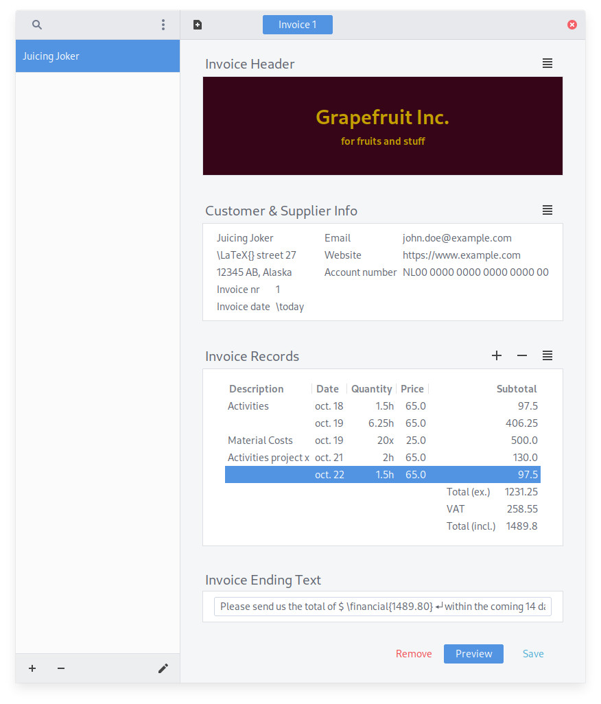

# GinVoice


Creating LaTeX invoices with a GTK GUI.

## Getting Started

GinVoice is currently present in MacLotsen's archive on Launchpad.
To install the package using apt, be sure to add the PPA:
```shell
sudo add-apt-repository ppa:maclotsen/ppa
sudo apt update && sudo apt install ginvoice
```

Or you can download the `.deb` file from [gitlab.gnome.org](https://gitlab.gnome.org/MacLotsen/ginvoice/-/releases) and execute the following from the Downloads directory:
```shell
sudo apt install ./ginvoice_1.0.3_all.deb
```
This will also install the dependencies.

[](https://xerdi.com/static/public/ginvoice-demo.mp4)

## Contributing

Please feel free to address an issue or create a pull request directly.

## Versioning

The version of this project uses 3 number positions separated by dots.
Optionally it'll have a post fix with the number of commits after tag leading with a short hash of the commit.

For example:
 - 0.0.1
 - 0.0.1-11-g8fdd034
 
So the second example is eleven commits ahead of the version with a short hash of `g8fdd034`.

## Authors

* **Erik Nijenhuis** - *Initial work* - [MacLotsen](https://gitlab.gnome.org/MacLotsen)

See also the list of [contributors](https://gitlab.gnome.org/MacLotsen/ginvoice/-/graphs/master) who participated in this project.

## License

This project is licensed under the GPLv3 License - see the [LICENSE.md](LICENSE.md) file for details

## Acknowledgments

* LuaLaTeX — for being able to generate the invoices
* Gtk/PyGtk — for creating the application
